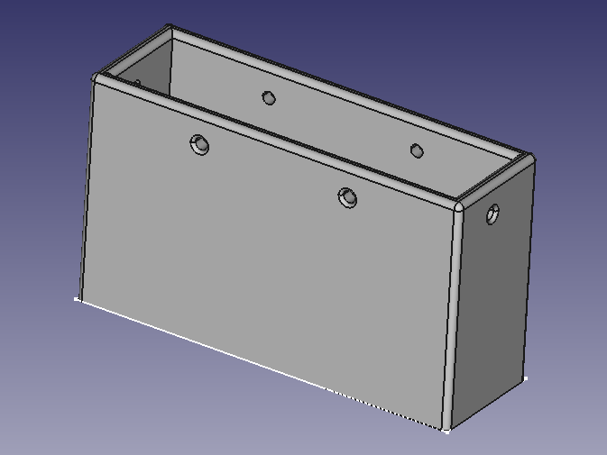
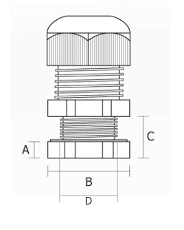

# Meanwell PSU EndCap
## Disclaimer
This disclaimer is mandatory reading before downloading, printing, assembling, or using any component of this design.
1. Extreme Danger Warning

MAINS VOLTAGE IS EXTREMELY DANGEROUS, POTENTIALLY LETHAL, AND CAN CAUSE FIRE, SERIOUS PERSONAL INJURY, OR DEATH.

    DO NOT attempt to use, assemble, or test this design unless you are a qualified, trained, and licensed professional electrician or electrical engineer.

2. General Disclaimer of Liability

This design, including all files, code, documentation, and 3D models (the "Design"), is provided "AS IS," without any warranty of any kind, either express or implied, including, but not limited to, the implied warranties of merchantability, fitness for a particular purpose, or non-infringement.

The creator(s) of this Design (the "Contributor(s)") provide it solely for educational, experimental, or non-commercial research purposes. The Contributor(s) make no representation or warranty that the Design is safe, reliable, or fit for any specific use, especially not for use with mains voltage.
3. Assumption of Risk

By downloading, printing, or using this Design, you, the User, acknowledge and agree that:

    You assume 100% of the risk associated with the use, assembly, and integration of this Design.

    The User is solely responsible for determining the appropriateness of the Design for their intended use and for all necessary safety precautions.

    The User is solely responsible for ensuring the printed parts are made from a material suitable for electrical insulation, temperature resistance, and mechanical strength requirements in their specific application, which may require materials far exceeding standard 3D printing filaments (like PLA or PETG).

4. No Professional Certification or Approval

    This Design is not certified, approved, or endorsed by any electrical safety organization (e.g., UL, CE, TUV, CSA).

    The Design has not been tested for dielectric strength, flammability, arc resistance, or long-term durability under live electrical conditions.

5. Indemnification and Release

The User agrees to release, indemnify, and hold harmless the Contributor(s) from any and all claims, demands, losses, liabilities, costs, and expenses (including attorney's fees) arising out of or in connection with the User's possession, use, modification, or distribution of the Design, including, but not limited to, any claim of personal injury, property damage, fire, or death caused by the Design.

## Overview

For:

- Meanwell LRS-350 (non PFC)
- Meanwell RSP-320 (PFC)

A: 5mm
B: 22mm
C: 15mm
D: 16mm

Somewhat parametric

## Bolt Length
Read PSU manual to determine maximum bolt length
